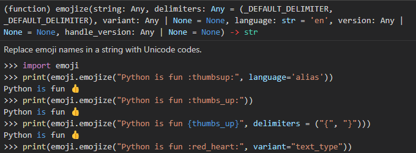

# Usage Example of SentimentAnalysisProject by Ryo(me)

## background

```
$ conda info 
-------------------------------------------------------------
    active environment : py38
    active env location : C:\Users\komin\anaconda3\envs\py38
            shell level : 2
       user config file : C:\Users\komin\.condarc
 populated config files : C:\Users\komin\anaconda3\.condarc
          conda version : 22.11.1
    conda-build version : 3.23.1
         python version : 3.9.15.final.0
       virtual packages : __archspec=1=x86_64
                          __cuda=11.6=0
                          __win=0=0
       base environment : C:\Users\komin\anaconda3  (writable)
      conda av data dir : C:\Users\komin\anaconda3\etc\conda
  conda av metadata url : None
           channel URLs : https://repo.anaconda.com/pkgs/main/win-64
                          https://repo.anaconda.com/pkgs/main/noarch
                          https://repo.anaconda.com/pkgs/r/win-64
                          https://repo.anaconda.com/pkgs/r/noarch
                          https://repo.anaconda.com/pkgs/msys2/win-64
                          https://repo.anaconda.com/pkgs/msys2/noarch
          package cache : C:\Users\komin\anaconda3\pkgs
                          C:\Users\komin\.conda\pkgs
                          C:\Users\komin\AppData\Local\conda\conda\pkgs
       envs directories : C:\Users\komin\anaconda3\envs
                          C:\Users\komin\.conda\envs
                          C:\Users\komin\AppData\Local\conda\conda\envs
               platform : win-64
             user-agent : conda/22.11.1 requests/2.28.1 CPython/3.9.15 Windows/10 Windows/10.0.22621
          administrator : False
             netrc file : None
           offline mode : False
```

```
$ conda list
---
# packages in environment at C:\Users\komin\anaconda3\envs\py38:
#
# Name                    Version                   Build  Channel
_tflow_select             2.3.0                       mkl
abseil-cpp                20211102.0           hd77b12b_0
absl-py                   1.3.0            py38haa95532_0
aiohttp                   3.8.3            py38h2bbff1b_0
aiosignal                 1.2.0              pyhd3eb1b0_0
astunparse                1.6.3                      py_0
async-timeout             4.0.2            py38haa95532_0
attrs                     22.1.0           py38haa95532_0
blas                      1.0                         mkl
blinker                   1.4              py38haa95532_0
bottleneck                1.3.5            py38h080aedc_0
brotli                    1.0.9                h2bbff1b_7
brotli-bin                1.0.9                h2bbff1b_7
brotlipy                  0.7.0           py38h2bbff1b_1003
ca-certificates           2022.10.11           haa95532_0
cachetools                4.2.2              pyhd3eb1b0_0
certifi                   2022.9.24        py38haa95532_0
cffi                      1.15.1           py38h2bbff1b_3
charset-normalizer        2.0.4              pyhd3eb1b0_0
click                     8.0.4            py38haa95532_0
colorama                  0.4.5            py38haa95532_0
contourpy                 1.0.5            py38h59b6b97_0
cryptography              38.0.1           py38h21b164f_0
cycler                    0.11.0             pyhd3eb1b0_0
emoji                     2.2.0              pyhd8ed1ab_0    conda-forge
flatbuffers               2.0.0                h6c2663c_0
flit-core                 3.6.0              pyhd3eb1b0_0
fonttools                 4.25.0             pyhd3eb1b0_0
freetype                  2.12.1               ha860e81_0
frozenlist                1.3.3            py38h2bbff1b_0
gast                      0.5.3              pyhd3eb1b0_0
giflib                    5.2.1                h62dcd97_0
glib                      2.69.1               h5dc1a3c_2
google-auth               2.6.0              pyhd3eb1b0_0
google-auth-oauthlib      0.4.4              pyhd3eb1b0_0
google-pasta              0.2.0              pyhd3eb1b0_0
grpcio                    1.42.0           py38hc60d5dd_0
gst-plugins-base          1.18.5               h9e645db_0
gstreamer                 1.18.5               hd78058f_0
h5py                      3.7.0            py38h3de5c98_0
hdf5                      1.10.6               h1756f20_1
icc_rt                    2022.1.0             h6049295_2
icu                       58.2                 ha925a31_3
idna                      3.4              py38haa95532_0
importlib-metadata        4.11.3           py38haa95532_0
intel-openmp              2021.4.0          haa95532_3556
joblib                    1.1.1            py38haa95532_0
jpeg                      9e                   h2bbff1b_0
keras                     2.9.0            py38haa95532_0
keras-preprocessing       1.1.2              pyhd3eb1b0_0
kiwisolver                1.4.2            py38hd77b12b_0
lerc                      3.0                  hd77b12b_0
libblas                   3.9.0           1_h8933c1f_netlib    conda-forge
libbrotlicommon           1.0.9                h2bbff1b_7
libbrotlidec              1.0.9                h2bbff1b_7
libbrotlienc              1.0.9                h2bbff1b_7
libcblas                  3.9.0           5_hd5c7e75_netlib    conda-forge
libclang                  12.0.0          default_h627e005_2
libcurl                   7.86.0               h86230a5_0
libdeflate                1.8                  h2bbff1b_5
libffi                    3.4.2                hd77b12b_6
libiconv                  1.16                 h2bbff1b_2
liblapack                 3.9.0           5_hd5c7e75_netlib    conda-forge
libogg                    1.3.5                h2bbff1b_1
libpng                    1.6.37               h2a8f88b_0
libprotobuf               3.20.1               h23ce68f_0
libssh2                   1.10.0               hcd4344a_0
libtiff                   4.4.0                h8a3f274_2
libvorbis                 1.3.7                he774522_0
libwebp                   1.2.4                h2bbff1b_0
libwebp-base              1.2.4                h2bbff1b_0
libxml2                   2.9.14               h0ad7f3c_0
libxslt                   1.1.35               h2bbff1b_0
lz4-c                     1.9.4                h2bbff1b_0
m2w64-gcc-libgfortran     5.3.0                         6    conda-forge
m2w64-gcc-libs            5.3.0                         7    conda-forge
m2w64-gcc-libs-core       5.3.0                         7    conda-forge
m2w64-gmp                 6.1.0                         2    conda-forge
m2w64-libwinpthread-git   5.0.0.4634.697f757               2    conda-forge
markdown                  3.3.4            py38haa95532_0
markupsafe                2.1.1            py38h2bbff1b_0
matplotlib                3.6.2            py38haa95532_0
matplotlib-base           3.6.2            py38h1094b8e_0
mkl                       2021.4.0           haa95532_640
mkl-service               2.4.0            py38h2bbff1b_0
mkl_fft                   1.3.1            py38h277e83a_0
mkl_random                1.2.2            py38hf11a4ad_0
msys2-conda-epoch         20160418                      1    conda-forge
multidict                 6.0.2            py38h2bbff1b_0
munkres                   1.1.4                      py_0
numexpr                   2.8.4            py38h5b0cc5e_0
numpy                     1.23.4           py38h3b20f71_0
numpy-base                1.23.4           py38h4da318b_0
oauthlib                  3.2.1            py38haa95532_0
openssl                   1.1.1s               h2bbff1b_0
opt_einsum                3.3.0              pyhd3eb1b0_1
packaging                 21.3               pyhd3eb1b0_0
pandas                    1.5.2            py38hf11a4ad_0
pcre                      8.45                 hd77b12b_0
pillow                    9.2.0            py38hdc2b20a_1
pip                       22.3.1           py38haa95532_0
ply                       3.11                     py38_0
protobuf                  3.20.1           py38hd77b12b_0
pyasn1                    0.4.8              pyhd3eb1b0_0
pyasn1-modules            0.2.8                      py_0
pycparser                 2.21               pyhd3eb1b0_0
pyjwt                     2.4.0            py38haa95532_0
pyopenssl                 22.0.0             pyhd3eb1b0_0
pyparsing                 3.0.9            py38haa95532_0
pyqt                      5.15.7           py38hd77b12b_0
pyqt5-sip                 12.11.0          py38hd77b12b_0
pysocks                   1.7.1            py38haa95532_0
python                    3.8.15               h6244533_2
python-dateutil           2.8.2              pyhd3eb1b0_0
python-flatbuffers        2.0                pyhd3eb1b0_0
python_abi                3.8                      2_cp38    conda-forge
pytz                      2022.1           py38haa95532_0
pyyaml                    6.0              py38h2bbff1b_1
qt-main                   5.15.2               he8e5bd7_7
qt-webengine              5.15.9               hb9a9bb5_4
qtwebkit                  5.212                h3ad3cdb_4
requests                  2.28.1           py38haa95532_0
requests-oauthlib         1.3.0                      py_0
rsa                       4.7.2              pyhd3eb1b0_1
scikit-learn              1.1.3            py38hd77b12b_0
scipy                     1.7.3            py38ha1292f7_0    conda-forge
setuptools                65.5.0           py38haa95532_0
sip                       6.6.2            py38hd77b12b_0
six                       1.16.0             pyhd3eb1b0_1
snappy                    1.1.9                h6c2663c_0
sqlite                    3.40.0               h2bbff1b_0
tensorboard               2.9.0            py38haa95532_0
tensorboard-data-server   0.6.1            py38haa95532_0
tensorboard-plugin-wit    1.8.1            py38haa95532_0
tensorflow                2.9.1           mkl_py38hff71f30_1
tensorflow-base           2.9.1           mkl_py38h6a7f48e_1
tensorflow-estimator      2.9.0            py38haa95532_0
termcolor                 2.1.0            py38haa95532_0
threadpoolctl             2.2.0              pyh0d69192_0
tk                        8.6.12               h2bbff1b_0
toml                      0.10.2             pyhd3eb1b0_0
tornado                   6.2              py38h2bbff1b_0
tqdm                      4.64.1           py38haa95532_0
typing_extensions         4.4.0            py38haa95532_0
urllib3                   1.26.13          py38haa95532_0
vc                        14.2                 h21ff451_1
vs2015_runtime            14.27.29016          h5e58377_2
werkzeug                  2.2.2            py38haa95532_0
wheel                     0.37.1             pyhd3eb1b0_0
win_inet_pton             1.1.0            py38haa95532_0
wincertstore              0.2              py38haa95532_2
wrapt                     1.14.1           py38h2bbff1b_0
xz                        5.2.8                h8cc25b3_0
yaml                      0.2.5                he774522_0
yarl                      1.8.1            py38h2bbff1b_0
zipp                      3.8.0            py38haa95532_0
zlib                      1.2.13               h8cc25b3_0
zstd                      1.5.2                h19a0ad4_0
```

```
$ nvcc -V
----------
nvcc: NVIDIA (R) Cuda compiler driver
Copyright (c) 2005-2018 NVIDIA Corporation
Built on Sat_Aug_25_21:08:04_Central_Daylight_Time_2018
Cuda compilation tools, release 10.0, V10.0.130
```

## Installation

- emoji
- matplotlib
- numpy
- sklearn
- keras
- tensorflow

```
$ conda install -c conda-forge emoji numpy matplotlib keras tensorflow
$ conda install -c anaconda scikit-learn
```

## Run
```
$ python SentimentAnalysisProject/main.py
--------------------
2022-12-18 10:26:15.687426: I tensorflow/core/platform/cpu_feature_guard.cc:193] This TensorFlow binary is optimized with oneAPI Deep Neural Network Library (oneDNN) to use the following CPU instructions in performance-critical operations:  AVX2
To enable them in other operations, rebuild TensorFlow with the appropriate compiler flags.
2022-12-18 10:26:15.688677: I tensorflow/core/common_runtime/process_util.cc:146] Creating new thread pool with default inter op setting: 2. Tune using inter_op_parallelism_threads for best performance.
Model: "model"
_________________________________________________________________
 Layer (type)                Output Shape              Param #
=================================================================
 input_1 (InputLayer)        [(None, 10)]              0

 embedding (Embedding)       (None, 10, 50)            20000050

 lstm (LSTM)                 (None, 10, 128)           91648

 dropout (Dropout)           (None, 10, 128)           0

 lstm_1 (LSTM)               (None, 128)               131584

 dropout_1 (Dropout)         (None, 128)               0

 dense (Dense)               (None, 5)                 645

 activation (Activation)     (None, 5)                 0

=================================================================
Total params: 20,223,927
Trainable params: 20,223,927
Non-trainable params: 0
_________________________________________________________________
Epoch 1/100
5/5 [==============================] - 3s 73ms/step - loss: 1.6029 - accuracy: 0.2500
Epoch 2/100
5/5 [==============================] - 0s 70ms/step - loss: 1.5697 - accuracy: 0.2727
Epoch 3/100
5/5 [==============================] - 0s 70ms/step - loss: 1.5526 - accuracy: 0.2955
Epoch 4/100
5/5 [==============================] - 0s 72ms/step - loss: 1.5268 - accuracy: 0.3561
Epoch 5/100
5/5 [==============================] - 0s 73ms/step - loss: 1.4825 - accuracy: 0.5455
Epoch 6/100
5/5 [==============================] - 0s 72ms/step - loss: 1.4161 - accuracy: 0.5909
Epoch 7/100
5/5 [==============================] - 0s 72ms/step - loss: 1.3705 - accuracy: 0.6061
Epoch 8/100
5/5 [==============================] - 0s 70ms/step - loss: 1.3334 - accuracy: 0.6061
Epoch 9/100
5/5 [==============================] - 0s 74ms/step - loss: 1.2351 - accuracy: 0.7424
Epoch 10/100
5/5 [==============================] - 0s 72ms/step - loss: 1.1746 - accuracy: 0.7576
Epoch 11/100
5/5 [==============================] - 0s 71ms/step - loss: 1.1379 - accuracy: 0.7879
Epoch 12/100
5/5 [==============================] - 0s 71ms/step - loss: 1.1129 - accuracy: 0.8106
Epoch 13/100
5/5 [==============================] - 0s 72ms/step - loss: 1.0948 - accuracy: 0.8409
Epoch 14/100
5/5 [==============================] - 0s 71ms/step - loss: 1.0787 - accuracy: 0.8333
Epoch 15/100
5/5 [==============================] - 0s 73ms/step - loss: 1.0653 - accuracy: 0.8485
Epoch 16/100
5/5 [==============================] - 0s 72ms/step - loss: 1.0392 - accuracy: 0.8712
Epoch 17/100
5/5 [==============================] - 0s 71ms/step - loss: 1.0309 - accuracy: 0.8712
Epoch 18/100
5/5 [==============================] - 0s 72ms/step - loss: 1.0533 - accuracy: 0.8561
Epoch 19/100
5/5 [==============================] - 0s 72ms/step - loss: 1.0166 - accuracy: 0.8864
Epoch 20/100
5/5 [==============================] - 0s 73ms/step - loss: 1.0026 - accuracy: 0.9091
Epoch 21/100
5/5 [==============================] - 0s 75ms/step - loss: 1.0030 - accuracy: 0.9091
Epoch 22/100
5/5 [==============================] - 0s 72ms/step - loss: 0.9984 - accuracy: 0.9167
Epoch 23/100
5/5 [==============================] - 0s 72ms/step - loss: 0.9800 - accuracy: 0.9394
Epoch 24/100
5/5 [==============================] - 0s 75ms/step - loss: 0.9712 - accuracy: 0.9470
Epoch 25/100
5/5 [==============================] - 0s 72ms/step - loss: 0.9658 - accuracy: 0.9470
Epoch 26/100
5/5 [==============================] - 0s 72ms/step - loss: 0.9898 - accuracy: 0.9167
Epoch 27/100
5/5 [==============================] - 0s 74ms/step - loss: 1.0141 - accuracy: 0.8864
Epoch 28/100
5/5 [==============================] - 0s 73ms/step - loss: 0.9776 - accuracy: 0.9242
Epoch 29/100
5/5 [==============================] - 0s 73ms/step - loss: 0.9941 - accuracy: 0.9091
Epoch 30/100
5/5 [==============================] - 0s 73ms/step - loss: 0.9607 - accuracy: 0.9470
Epoch 31/100
5/5 [==============================] - 0s 73ms/step - loss: 1.0113 - accuracy: 0.8939
Epoch 32/100
5/5 [==============================] - 0s 74ms/step - loss: 1.0830 - accuracy: 0.8258
Epoch 33/100
5/5 [==============================] - 0s 73ms/step - loss: 1.0265 - accuracy: 0.8788
Epoch 34/100
5/5 [==============================] - 0s 74ms/step - loss: 0.9478 - accuracy: 0.9621
Epoch 35/100
5/5 [==============================] - 0s 74ms/step - loss: 0.9767 - accuracy: 0.9394
Epoch 36/100
5/5 [==============================] - 0s 74ms/step - loss: 0.9387 - accuracy: 0.9697
Epoch 37/100
5/5 [==============================] - 0s 74ms/step - loss: 0.9461 - accuracy: 0.9621
Epoch 38/100
5/5 [==============================] - 0s 73ms/step - loss: 0.9416 - accuracy: 0.9621
Epoch 39/100
5/5 [==============================] - 0s 73ms/step - loss: 0.9368 - accuracy: 0.9621
Epoch 40/100
5/5 [==============================] - 0s 75ms/step - loss: 0.9292 - accuracy: 0.9773
Epoch 41/100
5/5 [==============================] - 0s 75ms/step - loss: 0.9325 - accuracy: 0.9773
Epoch 42/100
5/5 [==============================] - 0s 72ms/step - loss: 0.9274 - accuracy: 0.9773
Epoch 43/100
5/5 [==============================] - 0s 69ms/step - loss: 0.9284 - accuracy: 0.9773
Epoch 44/100
5/5 [==============================] - 0s 73ms/step - loss: 0.9275 - accuracy: 0.9773
Epoch 45/100
5/5 [==============================] - 0s 73ms/step - loss: 0.9244 - accuracy: 0.9773
Epoch 46/100
5/5 [==============================] - 0s 73ms/step - loss: 0.9261 - accuracy: 0.9773
Epoch 47/100
5/5 [==============================] - 0s 73ms/step - loss: 0.9149 - accuracy: 0.9924
Epoch 48/100
5/5 [==============================] - 0s 73ms/step - loss: 0.9196 - accuracy: 0.9848
Epoch 49/100
5/5 [==============================] - 0s 73ms/step - loss: 0.9252 - accuracy: 0.9848
Epoch 50/100
5/5 [==============================] - 0s 72ms/step - loss: 0.9146 - accuracy: 0.9924
Epoch 51/100
5/5 [==============================] - 0s 74ms/step - loss: 0.9140 - accuracy: 0.9924
Epoch 52/100
5/5 [==============================] - 0s 72ms/step - loss: 0.9156 - accuracy: 0.9924
Epoch 53/100
5/5 [==============================] - 0s 74ms/step - loss: 0.9112 - accuracy: 0.9924
Epoch 54/100
5/5 [==============================] - 0s 74ms/step - loss: 0.9256 - accuracy: 0.9773
Epoch 55/100
5/5 [==============================] - 0s 73ms/step - loss: 0.9287 - accuracy: 0.9697
Epoch 56/100
5/5 [==============================] - 0s 74ms/step - loss: 0.9217 - accuracy: 0.9848
Epoch 57/100
5/5 [==============================] - 0s 74ms/step - loss: 0.9187 - accuracy: 0.9848
Epoch 58/100
5/5 [==============================] - 0s 72ms/step - loss: 0.9110 - accuracy: 1.0000
Epoch 59/100
5/5 [==============================] - 0s 73ms/step - loss: 0.9162 - accuracy: 1.0000
Epoch 60/100
5/5 [==============================] - 0s 73ms/step - loss: 0.9098 - accuracy: 1.0000
Epoch 61/100
5/5 [==============================] - 0s 73ms/step - loss: 0.9123 - accuracy: 1.0000
Epoch 62/100
5/5 [==============================] - 0s 75ms/step - loss: 0.9083 - accuracy: 1.0000
Epoch 63/100
5/5 [==============================] - 0s 73ms/step - loss: 0.9071 - accuracy: 1.0000
Epoch 64/100
5/5 [==============================] - 0s 73ms/step - loss: 0.9059 - accuracy: 1.0000
Epoch 65/100
5/5 [==============================] - 0s 75ms/step - loss: 0.9063 - accuracy: 1.0000
Epoch 66/100
5/5 [==============================] - 0s 73ms/step - loss: 0.9058 - accuracy: 1.0000
Epoch 67/100
5/5 [==============================] - 0s 74ms/step - loss: 0.9053 - accuracy: 1.0000
Epoch 68/100
5/5 [==============================] - 0s 74ms/step - loss: 0.9054 - accuracy: 1.0000
Epoch 69/100
5/5 [==============================] - 0s 74ms/step - loss: 0.9054 - accuracy: 1.0000
Epoch 70/100
5/5 [==============================] - 0s 74ms/step - loss: 0.9053 - accuracy: 1.0000
Epoch 71/100
5/5 [==============================] - 0s 73ms/step - loss: 0.9053 - accuracy: 1.0000
Epoch 72/100
5/5 [==============================] - 0s 72ms/step - loss: 0.9055 - accuracy: 1.0000
Epoch 73/100
5/5 [==============================] - 0s 75ms/step - loss: 0.9053 - accuracy: 1.0000
Epoch 74/100
5/5 [==============================] - 0s 73ms/step - loss: 0.9054 - accuracy: 1.0000
Epoch 75/100
5/5 [==============================] - 0s 75ms/step - loss: 0.9053 - accuracy: 1.0000
Epoch 76/100
5/5 [==============================] - 0s 74ms/step - loss: 0.9052 - accuracy: 1.0000
Epoch 77/100
5/5 [==============================] - 0s 72ms/step - loss: 0.9051 - accuracy: 1.0000
Epoch 78/100
5/5 [==============================] - 0s 74ms/step - loss: 0.9052 - accuracy: 1.0000
Epoch 79/100
5/5 [==============================] - 0s 73ms/step - loss: 0.9053 - accuracy: 1.0000
Epoch 80/100
5/5 [==============================] - 0s 74ms/step - loss: 0.9053 - accuracy: 1.0000
Epoch 81/100
5/5 [==============================] - 0s 74ms/step - loss: 0.9051 - accuracy: 1.0000
Epoch 82/100
5/5 [==============================] - 0s 73ms/step - loss: 0.9052 - accuracy: 1.0000
Epoch 83/100
5/5 [==============================] - 0s 74ms/step - loss: 0.9052 - accuracy: 1.0000
Epoch 84/100
5/5 [==============================] - 0s 74ms/step - loss: 0.9052 - accuracy: 1.0000
Epoch 85/100
5/5 [==============================] - 0s 72ms/step - loss: 0.9053 - accuracy: 1.0000
Epoch 86/100
5/5 [==============================] - 0s 74ms/step - loss: 0.9052 - accuracy: 1.0000
Epoch 87/100
5/5 [==============================] - 0s 74ms/step - loss: 0.9051 - accuracy: 1.0000
Epoch 88/100
5/5 [==============================] - 0s 72ms/step - loss: 0.9052 - accuracy: 1.0000
Epoch 89/100
5/5 [==============================] - 0s 74ms/step - loss: 0.9051 - accuracy: 1.0000
Epoch 90/100
5/5 [==============================] - 0s 74ms/step - loss: 0.9053 - accuracy: 1.0000
Epoch 91/100
5/5 [==============================] - 0s 74ms/step - loss: 0.9051 - accuracy: 1.0000
Epoch 92/100
5/5 [==============================] - 0s 74ms/step - loss: 0.9052 - accuracy: 1.0000
Epoch 93/100
5/5 [==============================] - 0s 73ms/step - loss: 0.9051 - accuracy: 1.0000
Epoch 94/100
5/5 [==============================] - 0s 71ms/step - loss: 0.9051 - accuracy: 1.0000
Epoch 95/100
5/5 [==============================] - 0s 72ms/step - loss: 0.9051 - accuracy: 1.0000
Epoch 96/100
5/5 [==============================] - 0s 73ms/step - loss: 0.9052 - accuracy: 1.0000
Epoch 97/100
5/5 [==============================] - 0s 74ms/step - loss: 0.9051 - accuracy: 1.0000
Epoch 98/100
5/5 [==============================] - 0s 73ms/step - loss: 0.9051 - accuracy: 1.0000
Epoch 99/100
5/5 [==============================] - 0s 74ms/step - loss: 0.9052 - accuracy: 1.0000
Epoch 100/100
5/5 [==============================] - 0s 75ms/step - loss: 0.9052 - accuracy: 1.0000
2/2 [==============================] - 1s 4ms/step - loss: 1.0706 - accuracy: 0.8393

Test accuracy =  0.8392857313156128
2/2 [==============================] - 1s 3ms/step
Expected emoji::disappointed: prediction: work is hard  :smile:
Expected emoji::disappointed: prediction: This girl is messing with me  ❤️
Expected emoji:🍴 prediction: any suggestions for dinner        :smile:
Expected emoji::smile: prediction: you brighten my day  :disappointed:
Expected emoji::disappointed: prediction: she is a bully        ❤️
Expected emoji::smile: prediction: will you be my valentine     :disappointed:
Expected emoji::disappointed: prediction: go away       ⚾
Expected emoji::disappointed: prediction: yesterday we lost again       ⚾
Expected emoji:🍴 prediction: I did not have breakfast :smile:
1/1 [==============================] - 0s 14ms/step
very happy :smile:
```


### problem #1

```
$ python SentimentAnalysisProject/main.py
--------------------------
Traceback (most recent call last):
  File "d:/git/LSTM_RNN_Tutorials_with_Demo/SentimentAnalysisProject/main.py", line 2, in <module>
    from keras.models import Model
  File "C:\Users\komin\anaconda3\envs\py38\lib\site-packages\keras\__init__.py", line 21, in <module>
    from keras import models
  File "C:\Users\komin\anaconda3\envs\py38\lib\site-packages\keras\models\__init__.py", line 18, in <module>
    from keras.engine.functional import Functional
  File "C:\Users\komin\anaconda3\envs\py38\lib\site-packages\keras\engine\functional.py", line 24, in <module>
    import tensorflow.compat.v2 as tf
ModuleNotFoundError: No module named 'tensorflow'
```

### solve #1
install tensorflow
```
conda install -c conda-forge tensorflow
```

### problem #2
```
Traceback (most recent call last):
  File "d:/git/LSTM_RNN_Tutorials_with_Demo/SentimentAnalysisProject/main.py", line 4, in <module>
    from keras.layers.embeddings import Embedding
ModuleNotFoundError: No module named 'keras.layers.embeddings'
```

### solve #2
replaced
```
from keras.layers.embeddings import Embedding
```
with
```
from keras.layers import Embedding
```

### problem #3
```
Traceback (most recent call last):
  File "d:/git/LSTM_RNN_Tutorials_with_Demo/SentimentAnalysisProject/main.py", line 120, in <module>
    X_train, Y_train = read_csv('train_emoji.csv')
  File "d:\git\LSTM_RNN_Tutorials_with_Demo\SentimentAnalysisProject\emo_utils.py", line 37, in read_csv
    with open (filename) as csvDataFile:
FileNotFoundError: [Errno 2] No such file or directory: 'train_emoji.csv'
```

### solve #3
Chenge working directory as a current. Add `import os` and add below next line to `if __name__ == "__main__":`. 
```
os.chdir(os.path.dirname(os.path.abspath(__file__)))
```

### problem #4
```
Traceback (most recent call last):
  File "d:/git/LSTM_RNN_Tutorials_with_Demo/SentimentAnalysisProject/main.py", line 162, in <module>
    print('Expected emoji:' + label_to_emoji(Y_test[i]) + ' prediction: ' + X_test[i] + label_to_emoji(num).strip())
  File "d:\git\LSTM_RNN_Tutorials_with_Demo\SentimentAnalysisProject\emo_utils.py", line 64, in label_to_emoji
    return emoji.emojize(emoji_dictionary[str(label)], use_aliases=True)
TypeError: emojize() got an unexpected keyword argument 'use_aliases'
```

### solve #4
Introduction of `emoji.emojize` is below for version 2.2.0.


```
$ conda search -c conda-forge -f emoji
--------------------
Loading channels: done
# Name                       Version           Build  Channel
emoji                          0.5.1            py_0  conda-forge
emoji                          0.5.3            py_0  conda-forge
emoji                          0.6.0    pyh9f0ad1d_0  conda-forge
emoji                          1.0.1    pyhd8ed1ab_0  conda-forge
emoji                          1.4.1    pyhd8ed1ab_0  conda-forge
emoji                          1.4.2    pyhd8ed1ab_0  conda-forge
emoji                          1.5.0    pyhd8ed1ab_0  conda-forge
emoji                          1.6.0    pyhd8ed1ab_0  conda-forge
emoji                          1.6.1    pyhd8ed1ab_0  conda-forge
emoji                          1.6.3    pyhd8ed1ab_0  conda-forge
emoji                          1.7.0    pyhd8ed1ab_0  conda-forge
emoji                          2.0.0    pyhd8ed1ab_0  conda-forge
emoji                          2.1.0    pyhd8ed1ab_0  conda-forge
emoji                          2.2.0    pyhd8ed1ab_0  conda-forge
```

```
$ conda list
-----------
# packages in environment at C:\Users\komin\anaconda3\envs\py38:
#
# Name                    Version                   Build  Channel
...
emoji                     2.2.0              pyhd8ed1ab_0    conda-forge
...
```

replaced
```
return emoji.emojize(emoji_dictionary[str(label)], use_aliases=True)
```
with
```
return emoji.emojize(emoji_dictionary[str(label)])
```

<details><summary>View original README.md</summary><div>

# LSTM and RNN Tutorial with Demo (with Stock/Bitcoin Time Series Prediction, Sentiment Analysis, Music Generation)

There are many LSTM tutorials, courses, papers in the internet. This one summarizes all of them. In this tutorial, RNN Cell, RNN Forward and Backward Pass, LSTM Cell, LSTM Forward Pass, Sample LSTM Project: Prediction of Stock Prices Using LSTM network, Sample LSTM Project: Sentiment Analysis, Sample LSTM Project: Music Generation. It will continue to be updated over time.

**Keywords: Deep Learning, LSTM, RNN, Stock/Bitcoin price prediction, Sentiment Analysis, Music Generation, Sample Code, Basic LSTM, Basic RNN**

**NOTE: This tutorial is only for education purpose. It is not academic study/paper. All related references are listed at the end of the file.**

# Table of Contents
- [What is Deep Learning?](#whatisDL)
- [What is RNN?](#whatisRNN)
    - [RNN Cell](#RNNCell)
    - [RNN Forward Pass](#RNNForward)
    - [RNN Backward Pass](#RNNBackward)
    - [RNN Problem](#RNNProblem)
- [What is LSTM?](#whatisLSTM)
    - [LSTM Cell](#LSTMCell)
    - [LSTM Forward Pass](#LSTMForward)
- [SAMPLE LSTM CODE: Prediction of Stock Prices Using LSTM network](#SampleStock)
- [SAMPLE LSTM CODE: Sentiment Analysis](#Sentiment)
    - [Results](#SentimentResults)
    - [DataSet](#SentimentDataSet)
    - [Embeddings](#SentimentEmbeddings)
    - [LSTM Model in Sentiment Analysis](#SentimentLSTM)
- [SAMPLE LSTM CODE: Music Generation](#MusicGeneration)
    - [How to Run Code?](#MusicHowToRunCode)
    - [Input File and Parameters](#MusicInput)
    - [LSTM Model in Music Generation](#MusicLSTM)
    - [Predicting and Sampling](#MusicPredictingAndSampling)
- [Resources](#Resources)
- [References](#References)
  
  
## What is Deep Learning (DL)? <a name="whatisDL"></a>

"Deep Learning is a subfield of machine learning concerned with algorithms inspired by the structure and function of the brain called artificial neural networks." There are different types of DL models: Convolutional Neural Network, Recurrent Neural Networks (RNN), Long Short Term Memory (LSTM), Restricted Boltzmann Machine (RBM), Deep Belief Networks, etc.

In this tutorial, we are focusing on recurrent networks, especially LSTM. Basic RNN structure, Basic LSTM structures and Stock/Bitcoin Price Prediction Sample code are presented in the following sections. 


## What is RNN? <a name="whatisRNN"></a>

* Recurrent neural network (RNN) is a type of deep learning model that is mostly used for analysis of sequential data (time series data prediction). 
* There are different application areas that are used: Language model, neural machine translation, music generation, time series prediction, financial prediction, etc. 
* The aim of this implementation is to help to learn structure of basic RNN (RNN cell forward, RNN cell backward, etc..).
* Code is adapted from Andrew Ng's Course 'Sequential models'.

Code: https://github.com/omerbsezer/LSTM_RNN_Tutorials_with_Demo/tree/master/BasicRNN


### RNN Cell <a name="RNNCell"></a>


[Andrew Ng, Sequential Models Course, Deep Learning Specialization]

### RNN Forward Pass <a name="RNNForward"></a>


[Andrew Ng, Sequential Models Course, Deep Learning Specialization]

### RNN Backward Pass <a name="RNNBackward"></a>


[Andrew Ng, Sequential Models Course, Deep Learning Specialization]

### RNN Problem <a name="RNNProblem"></a>
- In theory, RNNs are absolutely capable of handling such “long-term dependencies.” 
- In practice, RNNs don’t seem to be able to learn them. 
- The problem was explored in depth by Hochreiter (1991) [German] and Bengio, et al. (1994) with [LSTM](https://www.bioinf.jku.at/publications/older/2604.pdf)

## What is LSTM? <a name="whatisLSTM"></a>

- It is a special type of RNN, capable of learning long-term dependencies.

- "Long short-term memory (LSTM) units are units of a recurrent neural network (RNN). An RNN composed of LSTM units is often called an LSTM network. A common LSTM unit is composed of a cell, an input gate, an output gate and a forget gate. The cell remembers values over arbitrary time intervals and the three gates regulate the flow of information into and out of the cell"

- Long Short Term Memory (LSTM) is a type of deep learning model that is mostly used for analysis of sequential data (time series data prediction). 

- There are different application areas that are used: Language model, Neural machine translation, Music generation, Time series prediction, Financial prediction, Robot control, Time series prediction, Speech recognition, Rhythm learning, Music composition, Grammar learning, Handwriting recognition, Human action recognition, Sign Language Translation,Time series anomaly detection, Several prediction tasks in the area of business process management, Prediction in medical care pathways, Semantic parsing, Object Co-segmentation.

- LSTM was proposed in 1997 by Sepp Hochreiter and Jürgen Schmidhuber and improved in 2000 by Felix Gers' team.
[Paper](https://www.bioinf.jku.at/publications/older/2604.pdf) 

Code: https://github.com/omerbsezer/LSTM_RNN_Tutorials_with_Demo/tree/master/BasicLSTM

### LSTM Cell <a name="LSTMCell"></a>


[Andrew Ng, Sequential Models Course, Deep Learning Specialization]

### LSTM Forward Pass <a name="LSTMForward"></a>


[Andrew Ng, Sequential Models Course, Deep Learning Specialization]


## SAMPLE LSTM CODE: Prediction of Stock Prices Using LSTM network <a name="SampleStock"></a>
Stock and ETFs prices are predicted using LSTM network (Keras-Tensorflow).

Code: https://github.com/omerbsezer/LSTM_RNN_Tutorials_with_Demo/tree/master/StockPricesPredictionProject

- Stock prices are downloaded from [finance.yahoo.com](https://finance.yahoo.com/). [Disneyland (DIS) Stock Price CSV file](https://github.com/omerbsezer/LSTM_RNN_Tutorials_with_Stock_Prices_Prediction/blob/master/Stock_Prices_Prediction_Example/DIS.csv).
- Closed value (column[5]) is used in the network, [LSTM Code](https://github.com/omerbsezer/LSTM_RNN_Tutorials_with_Stock_Prices_Prediction/blob/master/Stock_Prices_Prediction_Example/pricePredictionLSTM.py)
- Values are normalized in range (0,1).
- Datasets are splitted into train and test sets, 50% test data, 50% training data.
- Keras-Tensorflow is used for implementation.
- LSTM network consists of 25 hidden neurons, and 1 output layer (1 dense layer).
- LSTM network features input: 1 layer, output: 1 layer , hidden: 25 neurons, optimizer:adam, dropout:0.1, timestep:240, batchsize:240, epochs:1000 (features can be further optimized).
- Root mean squared errors are calculated.
- Output files:  [lstm_results](https://github.com/omerbsezer/LSTM_RNN_Tutorials_with_Stock_Prices_Prediction/blob/master/Stock_Prices_Prediction_Example/lstm_result.csv) (consists of prediction and actual values), plot file (actual and prediction values).


## SAMPLE LSTM CODE: Sentiment Analysis <a name="Sentiment"></a>

Sentiment Analysis is an analysis of the sentence, text at the document that gives us the opinion of the sentence/text. In this project, it will be implemented a model which inputs a sentence and finds the most appropriate emoji to be used with this sentence. Code is adapted from Andrew Ng's Course 'Sequential Models'.

**NOTE:This project is adapted from Andrew Ng, [Sequential Models Course](https://github.com/Kulbear/deep-learning-coursera/tree/master/Sequence%20Models), [Deep Learning Specialization](https://www.coursera.org/specializations/deep-learning) for educational purpose**

Code: https://github.com/omerbsezer/LSTM_RNN_Tutorials_with_Demo/tree/master/SentimentAnalysisProject

### Results <a name="SentimentResults"></a>


### DataSet <a name="SentimentDataSet"></a>
We have a tiny dataset (X, Y) where:

* X contains 127 sentences (strings)
* Y contains a integer label between 0 and 4 corresponding to an emoji for each sentence


[Andrew Ng, Sequential Models Course, Deep Learning Specialization]

### Embeddings <a name="SentimentEmbeddings"></a>

Glove 50 dimension, 40000 words of dictionary file is used for word embeddings. It should be downloaded from  https://www.kaggle.com/watts2/glove6b50dtxt (file size = ~168MB))


* word_to_index: dictionary mapping from words to their indices in the vocabulary (400,001 words, with the valid indices ranging from 0 to 400,000)
* index_to_word: dictionary mapping from indices to their corresponding words in the vocabulary
* word_to_vec_map: dictionary mapping words to their GloVe vector representation.

### LSTM Model in Sentiment Analysis <a name="SentimentLSTM"></a>

LSTM structure is used for classification.


[Andrew Ng, Sequential Models Course, Deep Learning Specialization]

Parameters:


## SAMPLE LSTM CODE: Music Generation  <a name="MusicGeneration"></a>

With trained DL model (LSTM), new sequences of time series data can be predicted. In this project, it will be implemented a model which inputs a sample jazz music and samples/generates a new music. Code is adapted from Andrew Ng's Course 'Sequential models'.

**NOTE:This project is adapted from Andrew Ng, [Sequential Models Course](https://github.com/Kulbear/deep-learning-coursera/tree/master/Sequence%20Models), [Deep Learning Specialization](https://www.coursera.org/specializations/deep-learning) for educational purpose**

Code: https://github.com/omerbsezer/LSTM_RNN_Tutorials_with_Demo/tree/master/MusicGenerationProject

### How to Run Code? <a name="MusicHowToRunCode"></a>
* To run code, download music21 toolkit from [http://web.mit.edu/music21/](http://web.mit.edu/music21/). "pip install music21". 
* Run main.py


### Input File and Parameters <a name="MusicInput"></a>
Model is trained with "data/original_music"
* "X, Y, n_values, indices_values = load_music_utils()"
* Number of training examples: 60,
* Each of training examples length of sequence:30
* Our music generation system will use 78 unique values. 

* X: This is an (m,  Tx , 78) dimensional array. We have m training examples, each of which is a snippet of  Tx=30Tx=30  musical values. At each time step, the input is one of 78 different possible values, represented as a one-hot vector. Thus for example, X[i,t,:] is a one-hot vector representating the value of the i-th example at time t.
* Y: This is essentially the same as X, but shifted one step to the left (to the past). 
* n_values: The number of unique values in this dataset. This should be 78.
* indices_values: python dictionary mapping from 0-77 to musical values.

### LSTM Model in Music Generation <a name="MusicLSTM"></a>
LSTM model structure is:


[Andrew Ng, Sequential Models Course, Deep Learning Specialization]

Model is implemented with "djmodel(Tx, n_a, n_values)" function.

### Predicting and Sampling: <a name="MusicPredictingAndSampling"></a>

Adding model, predicting and sampling feature, model structure is: 


[Andrew Ng, Sequential Models Course, Deep Learning Specialization]

Music Inference Model is similar trained model and it is implemented with "music_inference_model(LSTM_cell, densor, n_values = 78, n_a = 64, Ty = 100)" function. Music is generated with "redict_and_sample" function.
Finally, your generated music is saved in output/my_music.midi.


## Resources: <a name="Resources"></a>
- [LSTM Original Paper](https://www.bioinf.jku.at/publications/older/2604.pdf)
- Keras: [https://keras.io/](https://keras.io/)
- Tensorflow: [https://www.tensorflow.org/](https://www.tensorflow.org/)
- [LSTM in Detail](http://colah.github.io/posts/2015-08-Understanding-LSTMs/)
- [Music Toolkit: http://web.mit.edu/music21/](http://web.mit.edu/music21/)

## References: <a name="References"></a>
- [Andrew Ng, Sequential Models Course, Deep Learning Specialization](https://github.com/Kulbear/deep-learning-coursera/tree/master/Sequence%20Models)
- https://www.kaggle.com/pablocastilla/predict-stock-prices-with-lstm/notebook
- Basic LSTM Code is  adapted from Andrew Ng's Course 'Sequential models'.

</div></details>

